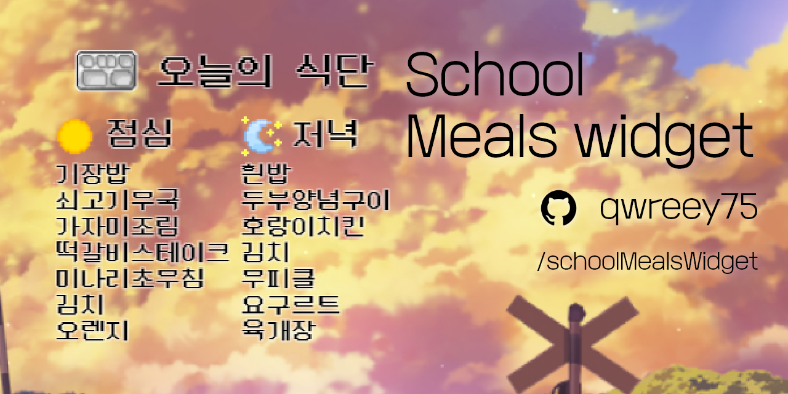

  

# 프로그램 받기

## 릴리즈 탭에서 받기

github 페이지 오른쪽의 릴리즈 탭에서 원하는 exe 파일을 받아줍니다.  

## 소스코드에서 빌드하기

이 프로젝트는 여러가지의 dependence 를 가집니다  
 + Visual Studio : Desktop development with C++  
 + nodejs / yarn  

먼저 이 저장소를 클론해 주시고  
```
git clone https://github.com/qwreey75/schoolMealsWidget
```

yarn 을 통해 업데이트 해줍니다  
```
yarn
```

그런 다음 빌드해서 설치 방식의 exe 를 만들어줍니다  
```
npx electron-builder build --win nsis
```

exe 를 실행에 설치를 마치면 사용할 수 있습니다  
